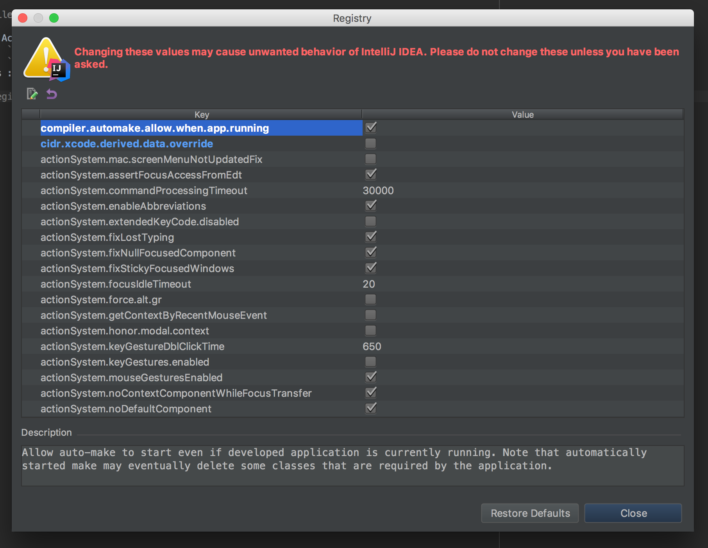
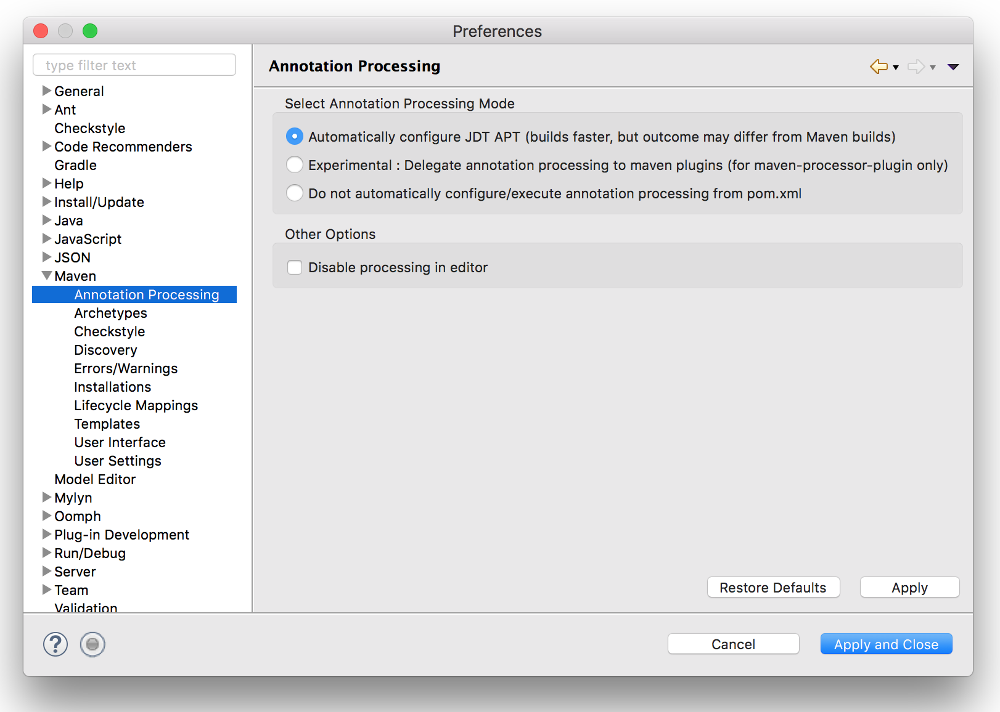

# Setup on Your Project

## Project Setup

### Configure Maven

To add Vue GWT to your Maven project, simply add the following to your `pom.xml`:

```xml
<project>
    <dependencies>
        ...
        <dependency>
            <groupId>com.axellience</groupId>
            <artifactId>vue-gwt</artifactId>
            <version>1.0.0</version>
        </dependency>
        <!-- Annotation Processors for Vue GWT -->
        <dependency>
            <groupId>com.axellience</groupId>
            <artifactId>vue-gwt-processors</artifactId>
            <version>1.0.0</version>
            <optional>true</optional>
        </dependency>
    </dependencies>
</project>
```

::: warning
Starting 1.0.0, Vue GWT has been tested with GWT 2.9.0.
:::

### Configure Annotation Processing

Vue GWT uses Java Annotation processing under the hood, this requires a little configuration.

First, in the `plugins` section of your Maven `pom.xml` add the following `plugin`:

```xml
<project>
    <plugins>
        ...
        <plugin>
            <groupId>org.apache.maven.plugins</groupId>
            <artifactId>maven-compiler-plugin</artifactId>
            <version>3.3</version>
            <configuration>
                <compilerArgument>-parameters</compilerArgument>
                <testCompilerArgument>-parameters</testCompilerArgument>
                <useIncrementalCompilation>false</useIncrementalCompilation>
                <source>1.8</source>
                <target>1.8</target>
            </configuration>
        </plugin>
    </plugins>
</project>
```

Then add this to expose templates to the annotation processor:

```xml
<build>
    <resources>
        <resource>
            <directory>src/main/java</directory>
        </resource>
    </resources>
</build>
```

### Configure `JsInterop`

Vue GWT relies heavily on GWT `JsInterop`.
It is not enabled by default in GWT 2.8, so you must enable it in your SuperDevMode and Maven configurations.

#### SuperDevMode
For SuperDevMode, simply add this flag to your devMode parameters:

`-generateJsInteropExports`

#### Maven
For Maven, if you use [GWT Maven Plugin](https://gwt-maven-plugin.github.io/gwt-maven-plugin/), add the following to your `pom.xml`:

```xml
<plugins>
    <!-- Mojo's Maven Plugin for GWT -->
    <plugin>
        ...
        <configuration>
            ...
            <generateJsInteropExports>true</generateJsInteropExports>
        </configuration>
    </plugin>
</plugins>
```

### Configure Your GWT App

#### Add the Module Dependency
You must add Vue GWT dependency in your module `.gwt.xml` file:

```xml
<inherits name='com.axellience.vuegwt.VueGWT'/>
```

### Bootstrap Vue GWT
In your application `EntryPoint` class, add this on top of the `onModuleLoad()` method:

```java
VueGWT.init();
```

This will inject Vue.js in your app, and init Vue GWT.

If you already have Vue.js included and you don't Vue GWT to inject it for you, you can call this instead:

```java
VueGWT.initWithoutVueLib();
```

## Configure your IDE

### IntelliJ

#### Vue GWT IntelliJ Plugin

First, install the [IntelliJ Vue GWT Plugin](https://plugins.jetbrains.com/plugin/10441-vue-gwt).
This will make IntelliJ re-process your Components templates when you save them.

You can find it in your IDE in `Preferences > Plugins > Browse Repositories... > Vue GWT`.

#### Enable Auto Build

By default IntelliJ doesn't support automatic annotation processing when the app is running.
But don't worry, enabling it is easy!

Go to `File -> Settings -> Build, Execution, Deployment -> Compiler` and enable “Make project automatically”

Open the Action window :
* Linux : `CTRL+SHIFT+A`
* MacOS : `SHIFT+COMMAND+A`
* Windows : `CTRL+ALT+SHIFT+/`

Enter `Registry...` and enable `compiler.automake.allow.when.app.running`.



Congratulation, you are good to go! **[Let's start using Vue GWT](getting-started.md)**

### Eclipse

#### Vue GWT Eclipse Plugin

First, install the [Vue GWT Eclipse Plugin](https://marketplace.eclipse.org/content/vue-gwt).
This will make Eclipse re-process your Components templates when you save them.

To install, just drag and drop the following button on your Eclipse window:

[  ](http://marketplace.eclipse.org/marketplace-client-intro?mpc_install=3923910 "Drag to your running Eclipse* workspace. *Requires Eclipse Marketplace Client")

#### Make Eclipse find your Templates

Because of the `resources` block in the `pom.xml`, Eclipse automatically adds a rule to ignore files in `src/main/java`.
This will throw an error that your templates cannot be found.

To fix this, the easiest way is placing the `resources` block from your pom.xml in a profile that will only be enabled when not in Eclipse.

So remove this block that you added in the project setup:
```xml
<resources>
    <resource>
        <directory>src/main/java</directory>
    </resource>
</resources>
```

And add this block instead:

```xml
<profiles>
	<profile>
		<id>vue-gwt-resources</id>
		<activation>
			<property>
				<name>!m2e.version</name>
			</property>
		</activation>
		<build>
			<resources>
				<resource>
					<directory>src/main/java</directory>
				</resource>
			</resources>
		</build>
	</profile>
</profiles>
```

::: warning
Adding this profile will disable your default Maven profiles if you have any.
So you will have to add `-PmyDefaultProfile` when compiling in command line.
:::

#### Annotation Processing

We then need to enable Annotation Processing on Eclipse.
First install the `m2e-apt` plugin:
[https://marketplace.eclipse.org/content/m2e-apt](https://marketplace.eclipse.org/content/m2e-apt).

Then you need to enable annotation processing for your project in the `m2e-apt` project settings:



Congratulation, you are good to go! **[Let's start using Vue GWT](getting-started.md)**

#### NetBeans

[Feedback](https://gitter.im/VueGWT/vue-gwt) for Vue GWT on NetBeans welcome.